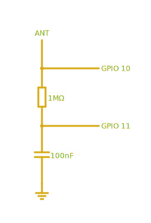

# Pico SDR

Using RP2040 / Raspberry Pi Pico as a software-defined radio receiver.

See the [blog post](https://blog.porucha.net/2024/pico-sdr/) for more information. Older code the article is mostly referring to can be found in the branch `old`.

## Circuit



## Software

1. Clone using `git clone --recursive` as this package is using a custom USB
   stdio library for better throughput and to avoid deadlocks.

2. Build and flash the firmware as usual:

   ```bash
   export PICO_SDK_PATH=/path/to/pico-sdk
   cmake -B build src
   cmake --build build
   picotool load -f build/pico_sdr.uf2
   ```

3. Start the USB serial to TCP bridge:

   ```bash
   python util/bridge.py
   ```

   You need to have PySerial and Click packages installed.

4. Open `grc/PicoSDR-WBFM.grc` in GNU Radio Companion, adjust carrier frequency to match your favorite FM radio station and press `F6`.

5. Alternatively [gqrx](https://www.gqrx.dk/) works fine with `rtl_tcp` input mode. Maximum sample rate seem to be 400 ksps, above that the samples are dropped.
